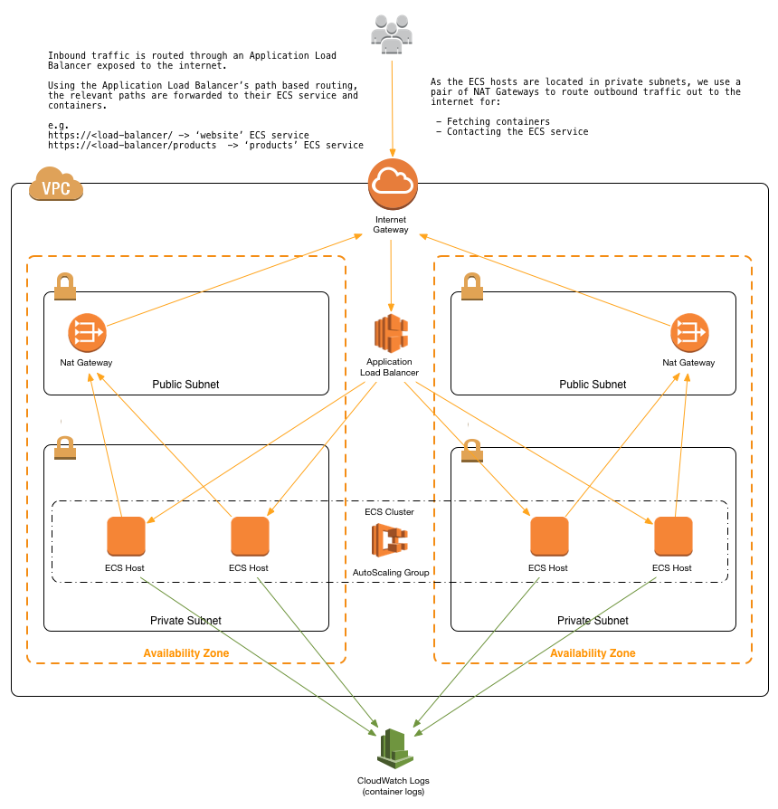

# Deployment of Sample Sinatra App (Hello World!)

REA Systems Engineer practical task
===================================

Goal: Provision a new application server and deploy the application using this Git repository
---------------------------------------------------------------------------------------------
- Cloud Platform: AWS - CloudFormation, ECS, Lambda, CloudWatch, SNS, ASG, EC2
- Technology: Container
- Scripting Language: Python, YAML - File Formatting, Shell Scripting
- Application Language: Ruby

Prerequisites:
--------------
- AWS account
- IAM User with full access to CloudFormation, IAM, EC2, ECS, SNS, CloudWatch, Lambda

How to Execute:
---------------
- Login to your AWS Account using IAM console user
- Go to CloudFormation from drop down list of Services
- Click on "Create Stack"
- Choose option "Specify an Amazon S3 template URL"
- Copy below given URL
  - https://s3-ap-southeast-1.amazonaws.com/dhaval-cf-test/sinatra-app/master.yaml

- Click Next
- Specify a stack name and go to next screen, do not modify anything in Options screen, click Next
- Check below given options
  - I acknowledge that AWS CloudFormation might create IAM resources with custom names.
  - I acknowledge that AWS CloudFormation might require the following capability: CAPABILITY_AUTO_EXPAND
- Click on Create
- On successful execution of all main and nested CloudFormation template, you will find WebsiteServiceUrl in Outputs section of main template.
- Open WebsiteServiceUrl to verify application deployment.

What it does do?
---------------
- Given template will create following resources
 - New VPC, 2 Public and 2 Private Subnets in 2 Availability Zones, NAT Gateway for each Availability zone, Internet Gateway, Route Tables
 - 2 Security groups. 1 for Access to the ECS hosts and the tasks/containers that run on them, 2 Access to the load balancer that sits in front of ECS.
 - Application Load Balancer with port 80 allowed
 - Lambda Function and Auto Scaling Lifecycle Hook to drain Tasks from your Container Instances when an Instance is selected for Termination in your Auto Scaling Group.
 - ECS cluster to the provided VPC and subnets using an Auto Scaling Group

 ## Overview

## Why use AWS CloudFormation with Amazon ECS?

Using CloudFormation to deploy and manage services with ECS has a number of nice benefits over more traditional methods ([AWS CLI](https://aws.amazon.com/cli), scripting, etc.).

#### Infrastructure-as-Code

A template can be used repeatedly to create identical copies of the same stack (or to use as a foundation to start a new stack).  Templates are simple YAML- or JSON-formatted text files that can be placed under your normal source control mechanisms, stored in private or public locations such as Amazon S3, and exchanged via email. With CloudFormation, you can see exactly which AWS resources make up a stack. You retain full control and have the ability to modify any of the AWS resources created as part of a stack.

#### Self-documenting

Fed up with outdated documentation on your infrastructure or environments? Still keep manual documentation of IP ranges, security group rules, etc.?

With CloudFormation, your template becomes your documentation. Want to see exactly what you have deployed? Just look at your template. If you keep it in source control, then you can also look back at exactly which changes were made and by whom.

#### Intelligent updating & rollback

CloudFormation not only handles the initial deployment of your infrastructure and environments, but it can also manage the whole lifecycle, including future updates. During updates, you have fine-grained control and visibility over how changes are applied, using functionality such as [change sets](https://aws.amazon.com/blogs/aws/new-change-sets-for-aws-cloudformation/), [rolling update policies](http://docs.aws.amazon.com/AWSCloudFormation/latest/UserGuide/aws-attribute-updatepolicy.html) and [stack policies](http://docs.aws.amazon.com/AWSCloudFormation/latest/UserGuide/protect-stack-resources.html).

Thank You!
Dhaval Bhatt
